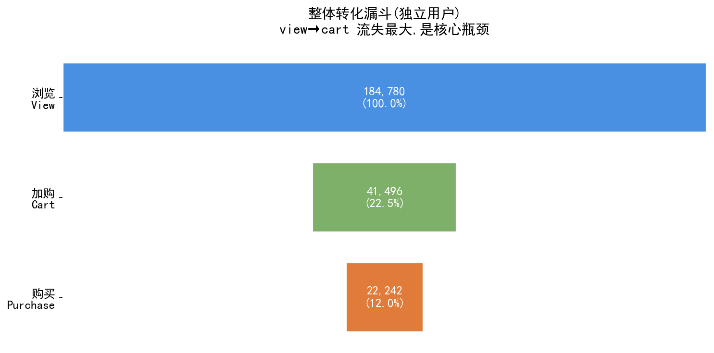
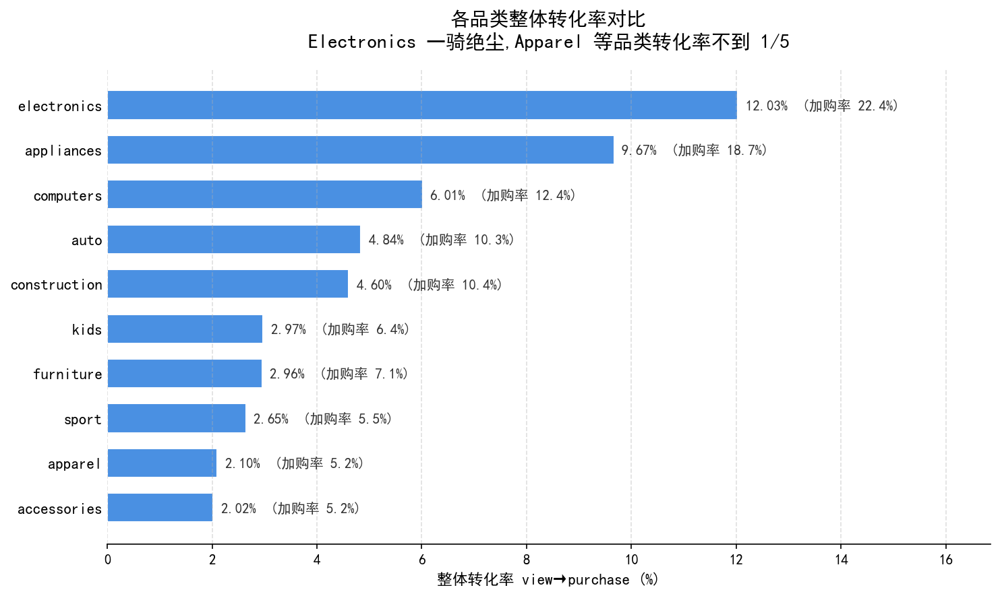

## 项目1：电商用户转化漏斗分析

> **基于 6750 万行真实电商行为数据,定位漏斗瓶颈、拆解品类差异、量化黑五效应。**

---

## 1. 业务问题

某电商平台希望理解用户从浏览到购买的完整转化路径,具体回答:

- 转化漏斗的核心流失环节在哪里?
- 不同品类的转化表现差异有多大,差在哪一步?
- 价格段对转化的影响如何?
- 黑色星期五是否真的有效?效应来自拉新还是激活老用户?

---

## 2. 数据说明

| 项目 | 详情 |
|---|---|
| 数据来源 | REES46 公开电商行为数据(2019-Nov.csv) |
| 原始规模 | 67,501,979 行用户行为事件 |
| 时间范围 | 2019-11-01 到 2019-11-30(含黑色星期五 11-29) |
| 独立用户数 | 3,696,117 |
| 独立商品数 | 190,662 |
| 关键字段 | event_time, event_type(view/cart/purchase), product_id, category_code, brand, price, user_id |
| 抽样策略 | **按用户随机抽样 5%**,固定 seed=42 保证可复现,保留用户完整行为序列以避免漏斗失真 |
| 抽样后规模 | 3,355,618 行,184,805 用户 |

---

## 3. 分析方法

1. **数据质量审查** — 识别异常日期与埋点变更段
2. **整体漏斗** — 按独立用户(非事件数)计算 view→cart→purchase
3. **品类拆解** — 按一级品类分组,对比各品类漏斗形态
4. **价格段拆解** — 对 Electronics 和 Apparel 按四分位数等频分箱,对比价格-转化关系
5. **黑五效应** — 剔除异常日后,对比 11-29 与日均水平

---

## 4. 关键发现

### 发现 1:核心瓶颈在 view→cart,不在 cart→purchase

整体漏斗显示:
- 浏览 → 加购:**22.5%**(主要流失)
- 加购 → 购买:**53.6%**(相对健康)
- 整体转化率:**12.0%**



**含义:** 优化资源应聚焦于商品页(主图、详情、价格表达),而非结账流程。

---

### 发现 2:品类差异巨大,Electronics 是 Apparel 的近 6 倍

| 品类 | view_to_cart | cart_to_purchase | 整体转化率 |
|---|---|---|---|
| electronics | 22.4% | 53.7% | **12.0%** |
| appliances | 18.7% | 51.8% | 9.7% |
| computers | 12.4% | 48.4% | 6.0% |
| kids | 6.4% | 46.5% | 3.0% |
| furniture | 7.1% | 41.6% | 3.0% |
| apparel | 5.2% | 40.1% | **2.1%** |
| accessories | 5.2% | 38.8% | 2.0% |



**含义:** 差距主要拉开在 view→cart 这一步(4 倍差距),cart→purchase 只有约 1.3 倍差距。说明 Apparel 类品的问题是"看了不动心",不是"加了不付款"。

---

### 发现 3:Kids / Sport 类品的加购是高质量信号

虽然这两类品 view→cart 转化率低(5-6%),但 cart→purchase 转化率反而较高(46-47%)。

**推理:** 这些品类有明确的人群门槛(有娃 / 有运动爱好),普通浏览用户不会进入。**一旦有人来看,本身就是高意向用户**——浏览即筛选。

**建议:** 这些品类应重点做"加购未购买召回",而非全量广告投放。预期 ROI 更高。

---

### 发现 4:价格-转化关系不是线性的,品类差异显著

**Electronics(对价格敏感度低,差距 1.3 倍):**

| 价格段 | 整体转化率 |
|---|---|
| 低价 (<$150) | 8.66% |
| 中低 ($150-260) | **9.30%** |
| 中高 ($260-575) | 7.09% |
| 高价 (>$575) | 7.00% |

**反直觉:** 转化率最高的不是最低价,而是中低价段。极低价电子产品可能引发质量怀疑。

**Apparel(对价格敏感度高,差距 1.9 倍,呈倒 U 型):**

| 价格段 | 整体转化率 |
|---|---|
| 低价 (<$60) | 0.88% |
| 中低 ($60-80) | 1.44% |
| 中高 ($80-100) | **1.70%** |
| 高价 (>$100) | 1.19% |

**反直觉:** 最低价的服装转化最差。$80-100 是"甜蜜点",太便宜被认为质量差,过 $100 触碰心理预算线。

**建议:** Apparel 运营资源应聚焦 $80-100 价位段。

---

### 发现 5:黑五效应来自"激活观望流量",而非"拉新流量"

剔除异常日期(11-15/16/17)与埋点变更段(11-08 前)后,对比黑五与日均水平:

|  | 平时日均 | 黑五 11-29 | 倍数 |
|---|---|---|---|
| 浏览用户数 | 10,069 | 11,043 | **1.10x** |
| 购买用户数 | 648 | 994 | **1.53x** |
| view→purchase 转化率 | 6.48% | 9.00% | **1.39x** |

**核心反差:** 流量仅增 10%,购买暴涨 53%。说明黑五**没有大规模拉新**,主要价值是激活同一批观望用户。

**推断:** 平时存在大量"看了不买"的高意向流量,他们在等价格信号,缺的是临门一脚。

**建议:**
1. 常态化"购物车未购买召回 + 限时小额优惠",平滑销售曲线,降低对单日大促的依赖。
2. 黑五策略无需重砸广告(流量本来就没靠广告增长),应把预算投向降价幅度本身与召回触达。
3. 后续可分品类验证不同品类的"观望流量比例"差异,优先在观望流量高的品类做常态化激活。

---

## 5. 数据质量说明

分析过程中识别并处理了以下数据质量问题:

| 日期 | 异常现象 | 推断原因 | 处理方式 |
|---|---|---|---|
| 11-15 | purchase=0(整天 0 购买) | 当天 purchase 事件采集中断 | 剔除该日 |
| 11-16, 11-17 | 转化率异常偏高(11-17 达 22.97%) | 11-15 数据延迟上报 | 剔除该两日 |
| 11-08 前 | view_to_cart 突然从 5% 跳到 12% | 加购埋点口径变更 | 日间对比仅使用 11-08 之后数据 |

---

## 6. 技术栈

- **Python**:pandas, numpy
- **可视化**:matplotlib
- **环境**:Anaconda + Jupyter Notebook

---

## 7. 复现方式

### 环境依赖

- Python 3.8+
- pandas
- numpy
- matplotlib

> 本项目基于 Anaconda 环境开发,以上依赖已全部预装,无需额外安装。

### 数据获取

1. 从 Kaggle 下载数据集:[eCommerce behavior data from multi category store](https://www.kaggle.com/datasets/mkechinov/ecommerce-behavior-data-from-multi-category-store)
2. 解压后,把 `2019-Nov.csv`(约 5.7 GB)放到本项目根目录

### 运行步骤

1. 启动 Jupyter Notebook(Anaconda Navigator → Jupyter Notebook)
2. 打开 `项目1_转化漏斗分析.ipynb`
3. 菜单 `Cell` → `Run All`

### 说明

- **首次运行**:程序会从 6750 万行原始数据中按用户抽样 5%,生成 `events_sample.csv`(约 350 MB)。这一步约需 1-2 分钟。
- **后续运行**:程序会自动检测 `events_sample.csv` 并直接读取,跳过抽样步骤,启动时间约 10 秒。
- **随机种子已固定**(seed=42),保证抽样结果可复现。

### 项目文件结构

```
项目1_转化漏斗/
├── README.md                          # 本文档
├── 项目1_转化漏斗分析.ipynb            # 完整分析 Notebook
├── events_sample.csv                  # 抽样数据(运行后生成)
├── fig1_funnel_overall.png            # 图 1:整体漏斗
├── fig2_category_conversion.png       # 图 2:品类转化率对比
└── 2019-Nov.csv                       # 原始数据(需自行下载,不上传 GitHub)
```

> ⚠️ `2019-Nov.csv` 文件过大(5.7 GB),不会上传到 GitHub。请按上述链接自行下载。


## 8. 作者

- **姓名:**【杨鑫宇】
- **邮箱:**【xxinyu173@gmail.com】
- **GitHub:**【https://github.com/Xinxin-1231】
